# 🔌 AI-Powered Electronic Component Analysis System


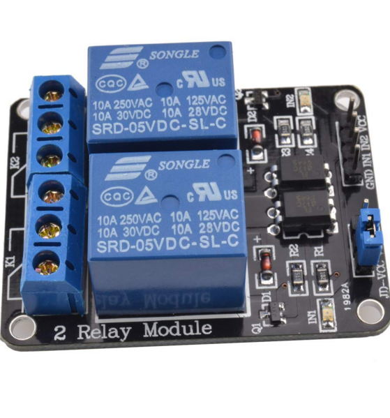

## 📌 Project Overview

A graduation engineering project that turns a single photo into a complete **electronic-component analysis pipeline**: image classification of individual components, YOLOv8 object detection and counting across populated PCBs, Grad-CAM explainability, and a Retrieval-Augmented Generation (RAG) assistant that teaches the user what the identified part actually does.

```text
Component photo / PCB photo
        ↓
Preprocessing (resize, ImageNet normalisation)
        ↓
AI Engine  →  Classifier (CNN)  +  YOLOv8 detector
        ↓
Interpretation  →  Grad-CAM heatmap, boxes & counts
        ↓
Knowledge Layer  →  RAG assistant + exportable PDF report
```

Four independent CNN backbones were trained and benchmarked under identical conditions, a controlled optimizer ablation was run to separate "architecture effect" from "optimizer effect," and every fine-tuned model was checked with Grad-CAM before being trusted.

---

## 🎯 Objective

Recognising a resistor, diode or small capacitor from appearance alone is a common stumbling block for electronics students and hobbyists, and manually counting/locating parts on a populated board (this project's detection set averages ~35 annotated parts per image) is slow and error-prone. The goals were to:

* Build a clean, stratified, leak-free classification pipeline across 3 component classes.
* Benchmark **ResNet18, DenseNet121, MobileNetV2 and EfficientNet-B0** under two transfer-learning regimes each (frozen feature extraction vs. partial fine-tuning).
* Run a **controlled Adam-vs-SGD ablation** to isolate the optimizer's real effect from trainable-capacity differences.
* Extend single-component recognition to full-board **object detection and automated counting** with YOLOv8.
* Make every prediction explainable with **Grad-CAM**, not just accurate.
* Package everything into a **Streamlit app** with a **RAG educational assistant** and exportable PDF reports.

---

## 📊 Dataset

### Classification corpus

| | |
|---|---|
| **Total images** | 741 |
| **Classes** | Resistor · Capacitor · Diode |
| **Train / Val / Test** | 518 (69.9%) / 111 (15.0%) / 112 (15.1%) |
| **Split strategy** | Stratified, fixed seed = 42 — class ratios preserved across all three sets |
| **Input resolution** | 224 × 224 RGB, ImageNet-normalised |
| **Augmentation (train only)** | Random horizontal flip, ±10° rotation, ±0.1 brightness/contrast jitter |

<p align="center">
  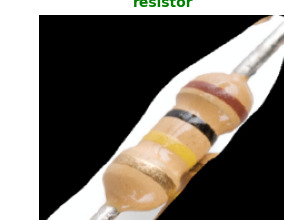
  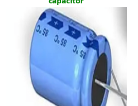
  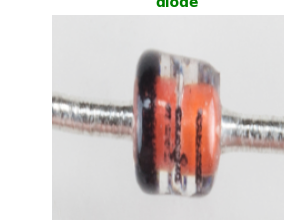
</p>

### PCB detection corpus

| | |
|---|---|
| **Images** | 1,646 (highly varied resolutions) |
| **Classes** | 22 component types |
| **Validation instances** | 8,337 across 236 boards (~35 parts/image) |
| **Class imbalance** | Extreme — largest class has 16,000+ instances, rarest has fewer than 20 |

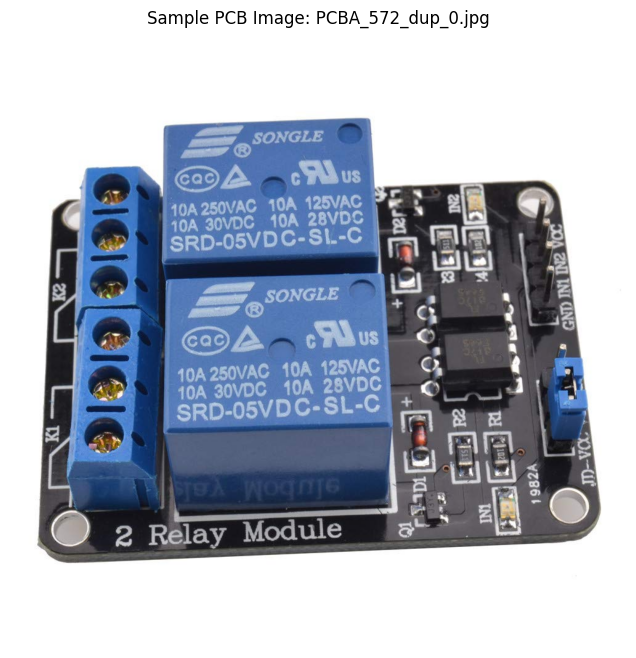

---

## 🧠 Classification — Four Backbones, Two Regimes Each

Every backbone was trained as **Model A** (backbone frozen, only the new head trained, Adam) and **Model B** (last stage unfrozen, SGD + momentum), so the benefit of deeper fine-tuning could be measured directly.

### ResNet18 — the reference baseline

Model A trains only 1,539 parameters in the classifier head; Model B unfreezes `layer4` (8.4M trainable parameters). Both used cross-entropy loss, `ReduceLROnPlateau`, and early stopping.

<p align="center">
  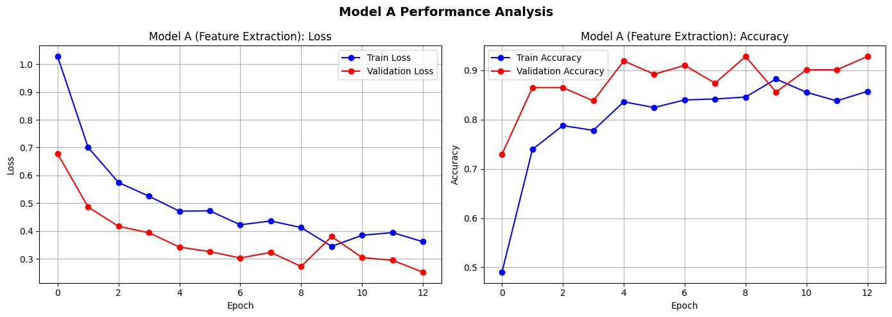
  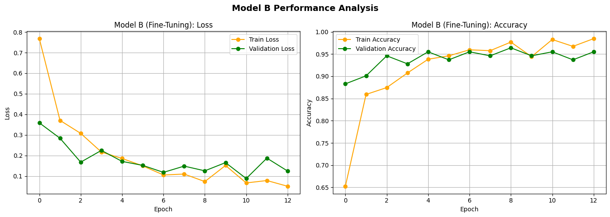
</p>

Model A plateaus around 92.79% validation accuracy — the single trainable layer can't separate the visually similar classes any further. Unfreezing `layer4` (Model B) pushes validation accuracy to 96.40%, and the fine-tuned model reaches **99.11% test accuracy** on the 112 held-out images:

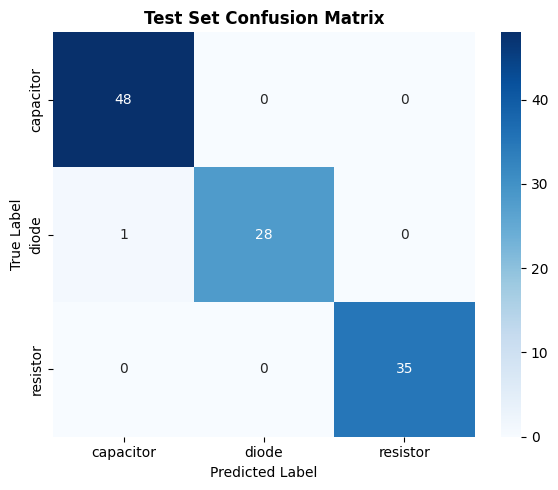

| Class | Precision | Recall | F1 |
|---|---:|---:|---:|
| Capacitor | 0.98 | 1.00 | 0.99 |
| Diode | 1.00 | 0.97 | 0.98 |
| Resistor | 1.00 | 1.00 | 1.00 |
| **Macro avg** | **0.99** | **0.99** | **0.99** |

Only one image is missed — a single diode absorbed into the capacitor class.

### DenseNet121 — best convergence of the study

Dense connectivity carries fine texture cues (colour bands, cathode stripes) all the way to the classifier. Fine-tuning `denseblock4` + `norm5` (BatchNorm kept frozen, important on a 518-image training set) converges to **99.10% validation accuracy in just 4 epochs**, and reaches **98.21% test accuracy**:

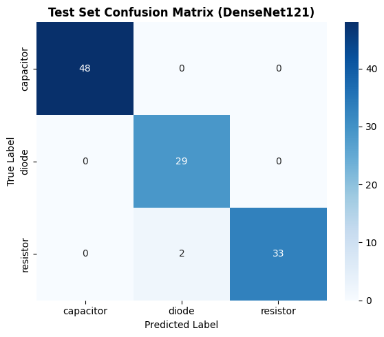

The only errors are two resistors misread as diodes — the same visually-plausible boundary case seen across every architecture in this study.

### MobileNetV2 — the efficiency candidate

Testing how much accuracy a lightweight, embedded-friendly backbone sacrifices: fine-tuning `features[14:]` reached 97.30% validation accuracy but only **95.54% test accuracy** — the weakest of the four, with the resistor/diode confusion most pronounced (diode precision 0.88).

### EfficientNet-B0 — the deployed model

Fine-tuning only the final MBConv stage (`features[7]`) plus the classifier head — **721,075 trainable parameters, just 18% of the network** — reached **99.10% validation accuracy in 79.5 seconds**, the top result of the four-way benchmark, and became the model shipped in the Streamlit app. Grad-CAM confirms it is looking at the right thing:

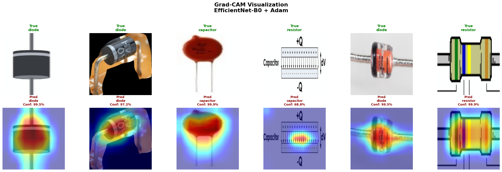

Exactly 1 of 111 validation images is wrong (a resistor called a diode at 81% confidence) — both parts share the same small, cylindrical, axial-leaded silhouette.

### Model comparison

| Model (selected regime) | Best val acc. | Test acc. | Precision* | Recall* | F1* | Test loss |
|---|---:|---:|---:|---:|---:|---:|
| **ResNet18** — layer4 + fc, SGD | 96.40% | **99.11%** | 0.99 | 0.99 | 0.99 | 0.0467 |
| **DenseNet121** — denseblock4, SGD | **99.10%** | 98.21% | 0.98 | 0.98 | 0.98 | 0.0767 |
| **MobileNetV2** — features[14:], SGD | 97.30% | 95.54% | 0.95 | 0.95 | 0.95 | 0.1394 |
| **EfficientNet-B0** — features[7], Adam | 99.10% | — † | — | — | — | — |

<sub>* macro-averaged over the three classes. † EfficientNet-B0 was evaluated on validation + Grad-CAM error analysis rather than the held-out test split.</sub>

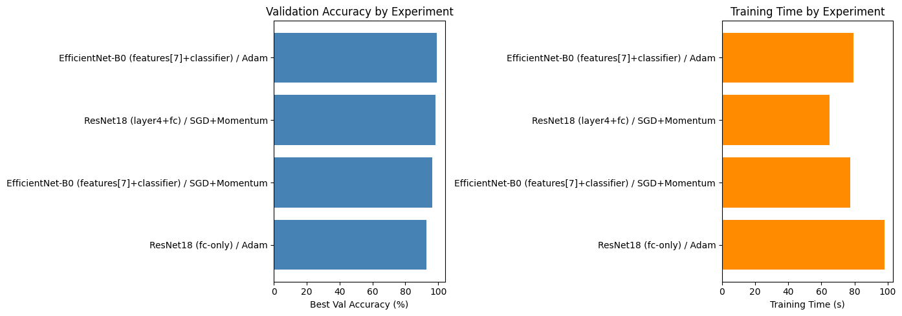

### Optimizer benchmarking — Adam vs. SGD

A controlled ablation (same trainable capacity — `layer4` + `fc` unfrozen — same learning-rate-matched setup) shows Adam and SGD **tie at 98.20%** validation accuracy. The apparent optimizer gap in the ranked leaderboard above is caused by *unequal trainable capacity between experiments*, not by the optimizer itself — Adam's real advantage is convergence speed (37.1 s vs. 64.7 s to the same accuracy).

**Key takeaway across all four backbones:** depth of adaptation (which layers get unfrozen) mattered far more than raw parameter count or choice of optimizer. Regularisation — frozen BatchNorm, dropout, weight decay, early stopping, train-only augmentation — is what kept a 518-image training set from being memorised.

---

## 🔍 PCB Object Detection — YOLOv8

Classification answers "what is this part?" for one component. Detection answers "what is on this board, where, and how many?" — the task manual inspection actually involves.

**Setup:** YOLOv8n, 640 px inputs, batch 16, mosaic 1.0 + mixup 0.1, 30 epochs, two training regimes compared (full fine-tune vs. first-10-layers-frozen + SGD).

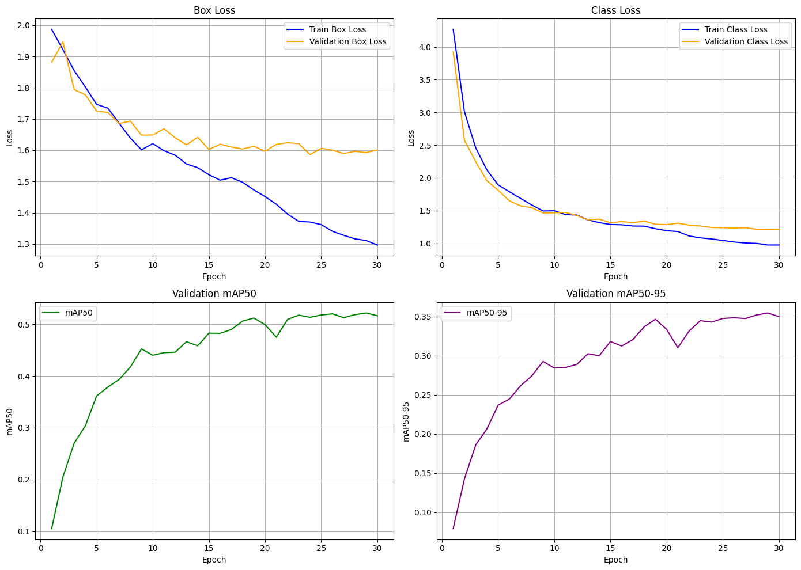

### Final performance (236 validation boards, 8,337 instances)

| Metric | Value |
|---|---:|
| mAP@50 | 0.522 |
| mAP@50-95 | 0.354 |
| Precision | 0.740 |
| Recall | 0.490 |

| Class | Instances | Precision | Recall | mAP50 |
|---|---:|---:|---:|---:|
| Battery | 16 | 0.890 | 1.000 | 0.995 |
| Relay | 32 | 0.810 | 1.000 | 0.980 |
| IC | 805 | 0.753 | 0.851 | 0.813 |
| Transistor | 252 | 0.905 | 0.682 | 0.743 |
| Diode | 226 | 0.733 | 0.482 | 0.552 |
| Capacitor | 2,212 | 0.671 | 0.427 | 0.469 |
| Resistor | 3,126 | 0.804 | 0.345 | 0.374 |
| Pads / pins | 343 | — | ~0.00 | ~0.00 |

Precision (0.74) far exceeds recall (0.49): when the detector calls a part, it's usually right — but it misses many. Large, distinctive parts are essentially solved (battery, relay); the hard cases are the small, densely-packed, massively over-represented passives, where hundreds of near-identical chips crowd a single board.

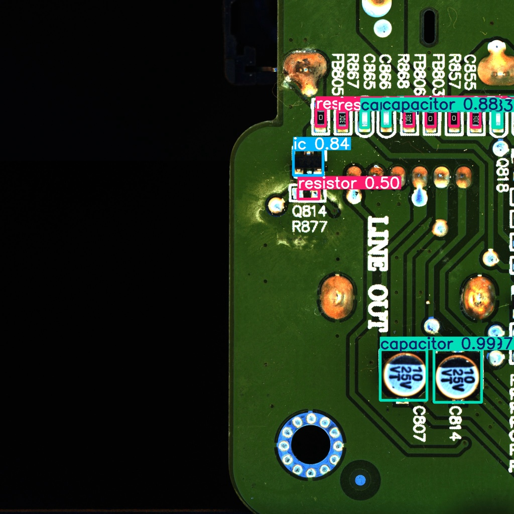

Each retained box is grouped by class to build an automated per-board component count — the basis of the app's bill-of-materials / inventory feature.

---

## 🖥️ Streamlit Application

A multi-page app that turns a photo into a complete analysis — no code, no notebook:

| Page | What it does |
|---|---|
| **Classifier** | Upload a JPG/PNG → predicted class, confidence %, top-3 breakdown, low-confidence warnings (<60%) and "possibly not a component" alert (<40%) |
| **Grad-CAM** | Original image, raw heatmap and blended overlay side by side |
| **AI Assistant** | RAG chatbot grounded in a curated component knowledge base |
| **Model Performance** | Benchmark table, confusion matrix and training curves of the deployed model |
| **History & PDF** | Session prediction log, exportable one-page PDF report |

**User flow:** Upload → Preprocess & Infer → Predict → Explain (Grad-CAM) → Ask (RAG) → Export (PDF).

---

## 🤖 RAG Educational Assistant

```text
Knowledge base (curated per-component text: specs, uses, ID tips)
        ↓
Chunk & embed (~600 chars, 80-char overlap) → FAISS index
        ↓
Retrieve top-4 relevant chunks for the user's question
        ↓
Generate — Gemini answers strictly from retrieved context,
           or says plainly that it doesn't know
```

A classifier outputs a word; the RAG layer turns that word into an actual explanation — grounded in curated reference material instead of an LLM's unconstrained guess — so the learner goes from "this is a diode" to why it looks that way and where it's used.

---

## 🛠️ Technologies Used

| Category | Technologies |
|---|---|
| Deep Learning | PyTorch, Torchvision (ResNet18, DenseNet121, MobileNetV2, EfficientNet-B0) |
| Object Detection | Ultralytics YOLOv8 |
| Explainability | Grad-CAM |
| RAG / LLM | LangChain, FAISS, Gemini |
| Web App | Streamlit |
| Data Handling | Pandas, NumPy, Pillow, Requests (web scraping) |
| Visualization | Matplotlib, Seaborn |

---

## 📁 Repository Structure

```text
electronic-component-ai/
│
├── README.md
│
├── web_scraping.py          # Dataset harvesting: scrape, dedupe (MD5), sanitize component imagery
├── models_resnet18.py        # ResNet18 Model A/B builder + matching optimizer factory
├── detection_yolo.py         # YOLOv8 inference wrapper + automated BOM/inventory counting
├── __init__.py                # Package exports
│
├── ADAM_SGD_EFFICIENTNET_GRADCAM_merged.ipynb   # EfficientNet-B0 training, optimizer ablation, Grad-CAM
├── DenseNet121_Maret.ipynb                       # DenseNet121 training & evaluation notebook
├── Electronic_Component_AI_Report.pptx           # Full project presentation
│
└── assets/
    ├── sample_resistor.png / sample_capacitor.png / sample_diode.png
    ├── resnet18_modelA_curves.png / resnet18_modelB_curves.png
    ├── resnet18_confusion_matrix.png / densenet121_confusion_matrix.png
    ├── model_comparison_chart.png
    ├── gradcam_efficientnet.png
    ├── pcb_sample_board.png / detection_output.jpg
    └── detection_training_curves.png
```

---

## ▶️ How to Run

Install dependencies:

```bash
pip install torch torchvision ultralytics ultralytics-thop \
            langchain faiss-cpu streamlit \
            pandas numpy scikit-learn matplotlib seaborn pillow requests
```

**1. Harvest / refresh the image dataset:**

```bash
python web_scraping.py
```

**2. Build & train a classifier (example: ResNet18):**

```python
from models_resnet18 import build_resnet18_classifier, get_optimizer

model = build_resnet18_classifier(num_classes=3, regime="fine_tune")
optimizer = get_optimizer(model, regime="fine_tune", lr=0.001)
```

**3. Run PCB detection & get an automated inventory count:**

```python
from detection_yolo import PCBComponentDetector

detector = PCBComponentDetector(model_weights="weights/yolov8n_pcb_best.pt", conf_threshold=0.25)
result = detector.parse_detections(raw_detections)
print(result["inventory_summary"])
```

**4. Launch the Streamlit app** *(app file not included in this snapshot of the repo)*:

```bash
streamlit run app.py
```

---

## ⚠️ Limitations

* Classification covers only 3 component classes on a 741-image corpus — small by deep-learning standards.
* Detection recall (0.49) and rare-class coverage are the weakest results; small, densely-packed passives are frequently missed.
* EfficientNet-B0, the deployed model, was never scored on the held-out classification test split.
* The RAG assistant depends on an external LLM service (Gemini) and the curated knowledge files staying in sync with the supported component classes.

---

## 🚀 Future Improvements

* Expand the classification corpus and add more component classes beyond resistor/capacitor/diode.
* Target the detector's recall gap with more resistor/capacitor imagery and augmentation tuned for small, dense objects.
* Score EfficientNet-B0 on the same held-out test split as the other three backbones for a fair final comparison.
* Deploy the classifier + detector behind a lightweight inference API instead of only the Streamlit app.
* Add drift monitoring / periodic re-training as new production images accumulate.

---

## 📄 License

This project is licensed under the **MIT License**.
